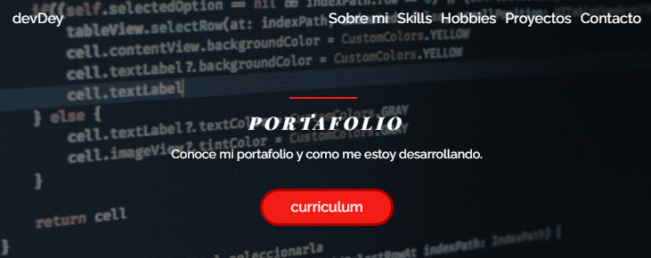

#  Mi Portafolio

###  
---

    

### Mi objetivo era la contrucción de la página principal este muy bien estructurado. 

## 📜¿Qué encontrarás?

#### Header o barra de navegación (incluye botón para descargar CV).
#### Banner con imagen y breve introducción.
#### Secciones: Sobre mi. Soft Skills. Hard Skills. Estudios o Formación. Proyectos como programador. Contáctame.
#### #10084;.

## 🥇 Objetivo:
#### La página fue contruida como proyecto o Challlenge planteado por [Alura Latam](https://www.aluracursos.com/) y [Oracle Next Education (One)](https://www.oracle.com/co/education/oracle-next-education/). 
#### Para lograrlo me apoye mediante herramientas como:
#### `Trello` `Discord` `Figma`
#### brindados por Oracle ONE y Alura Latam como orientación

## 🔡 Lenguajes

#### Los lenguajes utilizados fueron:

### HTML5
### JavaScript
### Css3

## Observaciones
